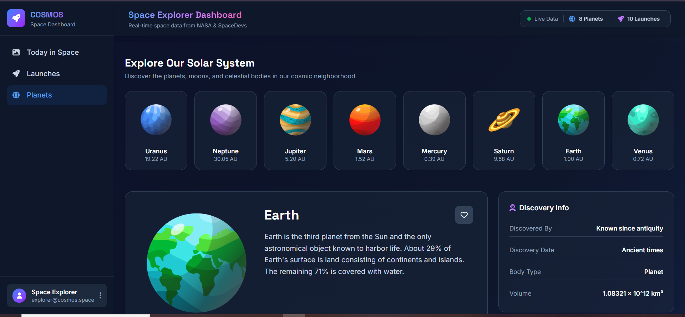

<div align="center">

# 🚀 COSMOS Space Dashboard

### Explore astronomy pictures, upcoming space launches, and planetary data through a modern interactive dashboard.


</div>

---

## 📌 Project Overview

**COSMOS Space Dashboard** is a responsive web application built with **HTML, CSS, and Vanilla JavaScript**.
It integrates real space APIs to display dynamic astronomy data, upcoming rocket launches, and detailed planet information in a modern user interface.

---

## ✨ Features

* 🌌 Display NASA Astronomy Picture of the Day.
* 📅 Select a specific date to load APOD data.
* 🚀 Show upcoming space launches from SpaceDevs API.
* ⭐ Update the Featured Launch when the user clicks any launch card.
* 🪐 Explore detailed planet information.
* 📊 Display orbital, physical, and discovery data for planets.
* 📱 Fully responsive layout.
* ⚡ Dynamic rendering using JavaScript and DOM manipulation.
* 🛡️ Error handling for API requests and missing data.

---

## 🛠️ Technologies Used

* HTML5
* CSS3
* JavaScript
* DOM Manipulation
* Fetch API
* NASA APOD API
* SpaceDevs Launches API
* Solar System OpenData API
* Font Awesome
* Responsive Design

---

## 📂 Project Sections

### 🌌 Today in Space

Displays NASA Astronomy Picture of the Day with title, image, date, media type, copyright, and explanation.

### 🚀 Upcoming Launches

Shows upcoming rocket launches with mission name, provider, rocket type, date, time, status, and location.

### ⭐ Featured Launch

The first launch is shown as the default featured launch.
When the user clicks any launch card, its data is displayed in the Featured Launch section.

### 🪐 Planets

Displays planet cards and detailed information such as mass, radius, density, gravity, orbital period, moons, discovery info, and orbital characteristics.

---

## 🧠 What I Learned

* How to fetch data from APIs using `fetch()`.
* How to handle asynchronous JavaScript with `async` and `await`.
* How to render API data dynamically into the page.
* How to use `data-*` attributes to connect HTML elements with JavaScript data.
* How to use event listeners and event delegation.
* How to update UI sections based on user interaction.
* How to handle missing API data safely.
* How to organize JavaScript functions in a real project.

---

## 🚀 Live Demo

🔗 [View Live Demo]([YOUR_LIVE_DEMO_LINK_HERE](https://nada-mahrous.github.io/COSMOS-Space-Dashboard/))

---

## 📸 Preview



---

## 📁 Folder Structure

```text
COSMOS-Space-Dashboard/
│
├── assets/
│   ├── css/
│   │   └── style.css
│   │
│   └── images/
│
├── index.html
├── main.js
└── README.md
```

---

## ⚙️ APIs Used

* NASA APOD API
* SpaceDevs Upcoming Launches API
* Solar System OpenData API

---

## 📌 Main JavaScript Concepts

* Variables
* Arrays
* Objects
* Functions
* Loops
* Conditions
* Template Literals
* DOM Selection
* DOM Events
* Event Delegation
* Fetch API
* Async / Await
* Error Handling
* Dynamic UI Rendering

---

## 👩‍💻 Author

**Nada Mahrous**

---

<div align="center">

### ⭐ If you like this project, feel free to star the repository.

</div>
